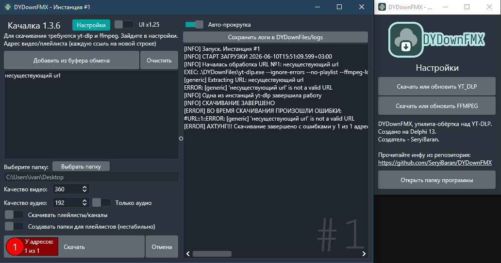

# DYDownFMX




Утилита-обёртка над YT-DLP. Создано на Delphi 13.0 FMX для Windows 10+.

Последняя версия - [скачать (11 815.5 KiB)](https://github.com/SeryiBaran/DYDownFMX/releases/latest/download/DYDownFMX.exe)

Перед использованием откройте `Настройки` и нажмите 2 кнопки - для скачивания YT-DLP и FFMPEG соответственно.

Если программа не работает или выдает ошибки, удалите папку `DYDownFiles` и перезапустите программу.

Настройки сохраняются в DYDownFiles/config.json, а история загрузок в DYDownFiles/history.txt.

Софтина кушает очень мало оперативки. При этом статично - что в фоне, что при работе жрет одинаково.


А ещё экономит ЦП - сделан тротлинг 250мс для вывода логов.

## Если не работают кнопки для установки YT-DLP и FFMPEG

1. Скачайте `yt-dlp.exe` отсюда:  
  [https://github.com/yt-dlp/yt-dlp/releases/latest/download/yt-dlp.exe](https://github.com/yt-dlp/yt-dlp/releases/latest/download/yt-dlp.exe)  
  Либо чтобы 100% работало (но постарее) - отсюда файл `yt-dlp.exe`:  
  [https://github.com/yt-dlp/yt-dlp/releases/tag/2025.06.30](https://github.com/yt-dlp/yt-dlp/releases/tag/2025.06.30)
2. Скачайте `ffmpeg-master-latest-win64-gpl.zip` отсюда:  
  [https://github.com/yt-dlp/FFmpeg-Builds/releases/latest/download/ffmpeg-master-latest-win64-gpl.zip](https://github.com/yt-dlp/FFmpeg-Builds/releases/latest/download/ffmpeg-master-latest-win64-gpl.zip)  
  Либо чтобы 100% работало (но постарее) - отсюда файл `ffmpeg-N-120064-g3b9dbda49b-win64-gpl.zip`:  
  [https://github.com/yt-dlp/FFmpeg-Builds/releases/tag/autobuild-2025-07-01-15-38](https://github.com/yt-dlp/FFmpeg-Builds/releases/tag/autobuild-2025-07-01-15-38)

Теперь скопируйте `yt-dlp.exe` в папку `DYDownFiles` рядом с программой (должна создаться после запуска программы), а из архива `ffmpeg-master-latest-win64-gpl.zip` вытащите из папки `bin` файл `ffmpeg.exe` и положите в `DYDownFiles/ffmpeg`.

Должно получиться такое древо:

```
- DYDownFiles
--- ffmpeg
--- --- ffmpeg.exe
--- yt-dlp.exe
```

## Для разрабов

Программа сделана на Delphi 13 со следующими библиотеками:

- DosCommand

HTTP(s) клиент украден с StackOverFlow, с Indy не получается без багов (я знал Delphi на практике всего около недельки на момент 2025-07-01T21:44:29+03:00).

### TODO

- Переписать конфиг на TIniFiles
- Сделать нормальное хранение настроек в коде. Заебало трехслойное сохранение
- Заюзать полезные фичи и код из моей нычки `E:\files\projects\delphi_projects` (мб progress bar, etc.)
- [https://docwiki.embarcadero.com/Libraries/Athens/en/System.Net.HttpClient.THTTPClient](https://docwiki.embarcadero.com/Libraries/Athens/en/System.Net.HttpClient.THTTPClient)
- Сделать README для юзаков в LaTeX
